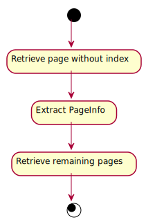
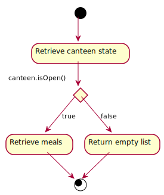

_This is an assignment to the class [Advanced Programming](https://hsro-inf-fpk.github.io) at the [University of Applied Sciences Rosenheim](http://www.th-rosenheim.de)._

# Assignment 11: Futures - CLI variant

This assignment covers the more advanced multithreading topics _futures_ and _future chaining_.
Futures are a feature of Java 8 and can be compared to the concept of _promises_ in JavaScript.

The internet contains lots of good articles about `Future<>` and `CompletableFuture<>` in Java.
For example [this one](http://www.deadcoderising.com/java8-writing-asynchronous-code-with-completablefuture/) covers everything you need to know for this assignment.

## Setup

1. Create a fork of this repository (button in the right upper corner)
1. Clone the project (get the link by clicking the green _Clone or download button_)
1. Import the project to your **IntelliJ**

_Remark: the given unit tests won't succeed until you have completed the first part of this assignment as they require the `CompletableFuture<>` Call Adapter registered in Retrofit!_

## Retrieving all canteens

The given CLI application has a menu which asks the user which action he wants to perform.
The following actions are available (Actions are implemented as an `enum` in `MenuStrategy`) :

* Show canteens - retrieves all canteens and prints them (including the id) to the STDOUT
* Set canteen - reads an integer as canteen id
* Set date - reads a date string and updates the currently selected date
* Show meals - retrieves all meals of the currently selected canteen and date and prints them to the STDOUT

The first step is to complete the `SHOW_CANTEENS` strategy.
The following flow chart shows how to proceed :

### Retrieve the first page of canteens 

Use the method `getCanteens()` of the OpenMensaAPI to retrieve the fist page of canteens (without index).
The method returns an instance of `Response<List<Canteen>>`.
That might be a little bit confusing but the OpenMensaAPI does not expose a dedicated pagination endpoint to retrieve the total count of items or the total count of pages but exposes this information in the response headers (`X-Total-Pages`, `X-Total-Count`, ...).
To be able to extract this information you need the `Response<>` wrapper because the wrapper includes a reference to the headers.

### Extract the pagination information

There's a given utility class `PageInfo` which extracts the pagination information from a generic `Response<>` object. To create a `PageInfo` instance use the static factory method `PageInfo.extractFromResponse(...)`.

### Retrieve the remaining pages

When you have the pagination information extracted you can retrieve the remaining pages with the method `getCanteens(int pageNumber)` of the OpenMensaAPI.
As always there's not **one** solution but different ways to accomplish this!
But no matter which approach you're chosing you have to wait for all responses to be retrieved to display a complete list of canteens before you leave the method because otherwise the main menu is printed in the middle of the list of canteens.

## Retrieve the meals of a day

The second (and last) step is to complete the MenuStrategy `SHOW_MEALS`.
This strategy should retrieve the meals of specific day served at a specified canteen.

The following flow chart shows how to proceed:

### Retrieve the canteen state

At first you have to validate that there's a canteen selected (i.e. the `currentCanteenId` may not be less or equal 0!).
Afterwards you should fetch the state of the canteen at the given date (default date is today, `dateFormat.format(currentDate.getTime())` formats the currently selected date as required by the API).
The required method to fetch a state is already present in the OpenMensaAPI.

### Retrieve the meals

If you retrieved the state of the canteen at it is open at the specified date you have to retrieve the meals for the same params.
Keep in mind to block the main thread to display the retrieved meals after you retrieved them.
If the canteen is not open at the specified date a meaningful message should be printed to inform the user, that the date has to be changed.
